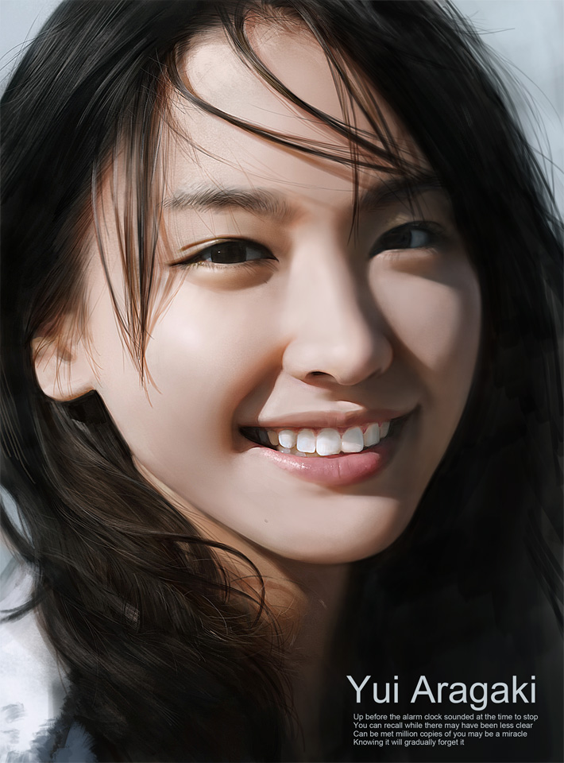
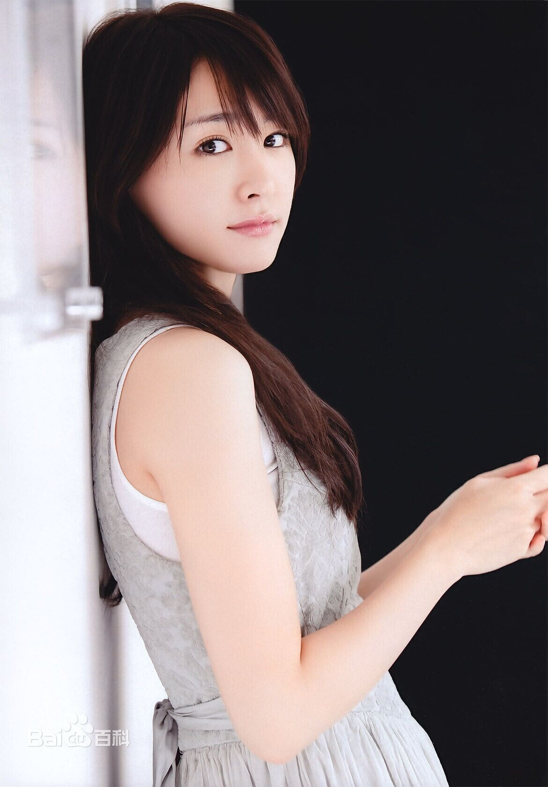
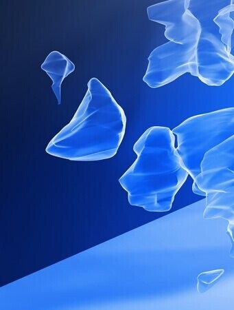
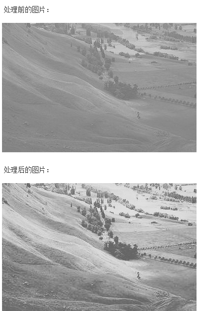

KK主讲:基本图像处理技术
==

时间: 2014-12-25 20:51 ～ 21:51

#######铁锚锚 20:54:01 
这是用什么技术做出来的图?怎么这么清晰?
#######小菜菜 20:55:48 
你看下多大
#######铁锚锚 20:56:22 
224KB
#######小菜菜 20:58:22 
不算小
#######铁锚锚 20:58:52 
感觉很清晰，是光线的作用吗?
#######小菜菜 21:00:36 
ps处理的很好
#######小菜菜 21:01:45 
细节去掉了很多 但是画面很干净, 光线应用的到位,照片很饱满
#######小菜菜 21:02:45 
焦点集中 画面有层次感
#######铁锚锚 21:03:56 
外焦里嫩?

#######小菜菜 21:04:01 
为什么决定好清楚 也不是很大
#######铁锚锚 21:04:41 
线条自然，则整体感就强
#######小菜菜 21:05:08 
因为颜色少
#######铁锚锚 21:09:03 
日本人研究的比较深。
#######铁锚锚 21:09:12 
中国的设计师其实也有利害的。但大师级作品还是少。。。很少见
#######小菜菜 21:10:04 
图片一般都会被压缩的, 跟文件压缩的原理一样
#######小菜菜 21:10:37 
用相机拍的照片没压缩之前，一般非常大, 因为它保留了所有的信息,每个点，每个像素什么颜色，
#######小菜菜 21:11:52 
镜头里的影像每个相邻像素点有差别，都可能会反应到照片上来,所以文件会很大，一般手机拍的一个文件也得2M,单反会更大一些
#######小菜菜 21:13:01 
但是我们发现图片里的像素之间是有规律的
#######小菜菜 21:13:19 
相邻的一片，像素的颜色值基本差不多
#######小菜菜 21:13:24 
比如你脸的皮肤
#######小菜菜 21:13:37 
背景的一面墙，天空的一大片蓝
#######小菜菜 21:14:03 
这些模式我们搞清楚了，就可以压缩图片了
#######小菜菜 21:14:29 
就像我们搞清楚了文本的重复模式，就可以压缩文本文件到几分之一的程度
#######铁锚锚 21:14:39 
原来是这个道理
#######小菜菜 21:14:59 
不同的是，文本文件的压缩，都是无损的,可以完全还原的
#######小菜菜 21:15:11 
图片的压缩分为有损和无损，一般我们见到的都是有损压缩, 去掉细节，从而减小文件大小
#######小菜菜 21:15:58 
比如jpg的压缩时，可以设置压缩质量; 质量参数越低，效果越差，文件越小。视频压缩也是一个道理。

#######小菜菜 21:18:32 
如果你看过以前的电影胶片，你就会知道，视频是一帧帧的，前后几十帧的差别都很小，所以可以有很大的压缩率。早期的rmvb压缩，压的比例很大的时候，画面会花。

#######铁锚锚 21:18:49 

#######铁锚锚 21:18:59 
这张图怎么压缩?

#######小菜菜 21:20:25 
我们知道常用的颜色模型RGBA，4个byte表示一个颜色值，

#######小菜菜 21:23:15 
每个点都是4个byte，那么一个`1024*1024`的图片，会是多大呢
#######小菜菜 21:24:26 
至少要**4M**吧
#######小菜菜 21:24:59 
实际上我们常见的一个差不多这么大的壁纸图片文件也就几百K，
#######小菜菜 21:25:12 
还是前面说的原理, 图片里含有大量的大片颜色相似的区域, 整个图片也用不了颜色空间里所有的颜色
#######小菜菜 21:26:35 
那么，我们就可以先计算下:

1. 我们需要用哪些颜色，这就是调色板信息，放到图片文件头里。相当于压缩文件里的字典。
2. 我们对于图片里大片类似的，渐变的区域，进行采样，然后渲染出图片的时候，用一定的差值方法，把中间或周围我们没有记录的点，再拟合出来就成了

#######小菜菜 21:28:42 

#######小菜菜 21:28:49 
比如我桌面里的这一块图像。

#######小菜菜 21:28:57 

1. 用的颜色很少, 基本都是蓝色
2. 深蓝色的大片区域和浅蓝色的区域，就可以通过采样，取一定数目的点，计算他们和他们中间的点，颜色差别非常之小的话，那么我们只需要记录这些采样的点的信息即可
3. 再还原出这个图片的时候，我们只需要用这些点的信息，拟合中间的点的信息，比如按梯度取平均值，填充进去即可。

#######小菜菜 21:31:45 
这只是最简单的压缩办法。
#######小菜菜 21:32:51 
压太多，就会失真，有锯齿，图片模糊，重点细节丢失。
#######小菜菜 21:33:16 
所以，计算机图像处理这门学科里有各种办法来处理这些细节问题。
#######小菜菜 21:33:40 
怎么保证压缩的图像，重要细节不丢失，怎么反锯齿，怎么保障图片不曝光过度，也不要太暗, 怎么知道图片里有一些东西是噪声，怎么去掉噪声,这里可以讲讲图像过白或过暗的处理，
#######小菜菜 21:36:33 
很简单，我们知道有的颜色是冷色，有的是暖色
#######铁锚锚 21:37:15 
怎么简单了?
#######小菜菜 21:37:47 
或者对应到RGB上来说，每个颜色都可以分解成RGB三个分量。
#######小菜菜 21:38:07 
RGB这三个纯色对人眼来说的亮度是不一样的。 假设每个对人眼来说的亮度值比重分别是 `v1 v2 v3`. 那么每个颜色都可以先转换成RGB，然后算出这个颜色的亮度值

	V = R*v1+G*v2+B*v3

#######小菜菜 21:40:18 
那么对图片上所有的像素都这么处理下，就知道所有点的亮度值，我们一般叫 灰度值. 把图片的点都换成这个灰度值，图像就变成了灰度图
#######小菜菜 21:41:14 
每个点的范围都是`0-255`,然后统计图上`0-255`这256级灰度的点的数量，就得到一个统计的柱状图，这个图，叫直方图。
#######小菜菜 21:43:05 
如果直方图的靠近0（即是黑）这头的点比较多，说明图像偏暗。
#######小菜菜 21:43:32 
如果靠近255（白）这头的点比较多，说明图像曝光过度，太白了。
#######小菜菜 21:44:22 
然后用统计方法，重新调整所有点的灰度值，使得整体的灰度值分布比较均匀即可。
#######小菜菜 21:45:05 
然后可以用这些调整好的灰度，再结合以前的点的实际颜色，把点调整成彩色的就完成了。
#######小菜菜 21:45:16 
整个图像还是彩色的，而且不是那么太亮，或者太暗了。这叫直方图均衡化。
#######小菜菜 21:46:22 
常见的例子
#######小菜菜 21:46:22 

#######小菜菜 21:46:33 
可以看到，调整前，图片好暗，对比度很差，做了直方图均衡化以后，整个图片看起来舒服多了。

#######铁锚锚 21:47:15 
这个高端
#######小菜菜 21:47:48 
计算机图像处理里面有很多方法和技巧。
#######小菜菜 21:48:02 
有空再讲，比如膨胀，腐蚀啊，各种变换啦。
#######小菜菜 21:49:32 
over
#######小菜菜 21:53:05 
再解释一句，图像太亮或太暗，相当于说颜色的区分度不高，直方图均衡化可以看做是把像素点的差距拉大，增加对比度。
#######铁锚锚 21:55:49 
从QQ里面保存出来的图片,大小损失了一半