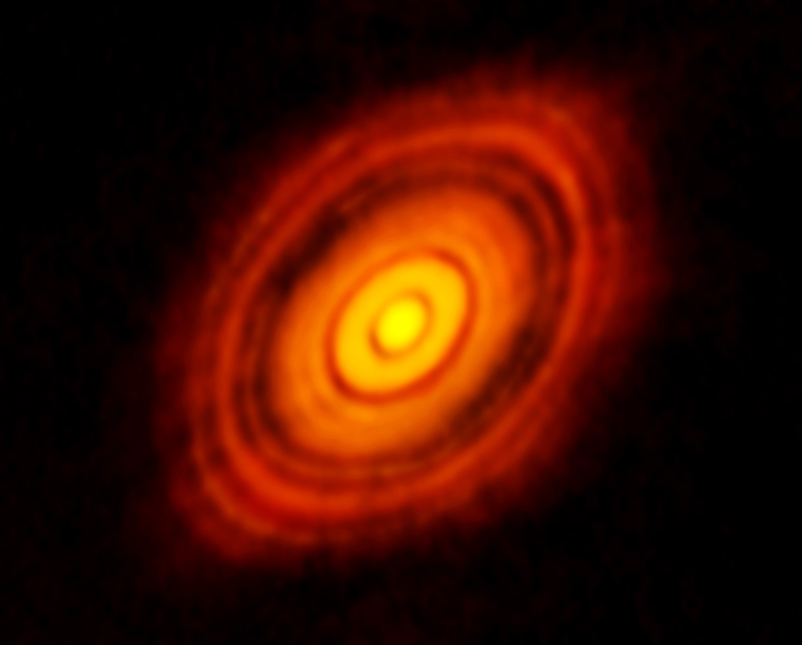
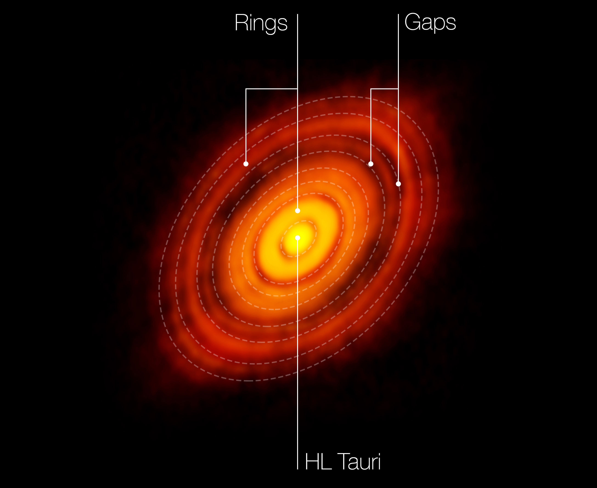
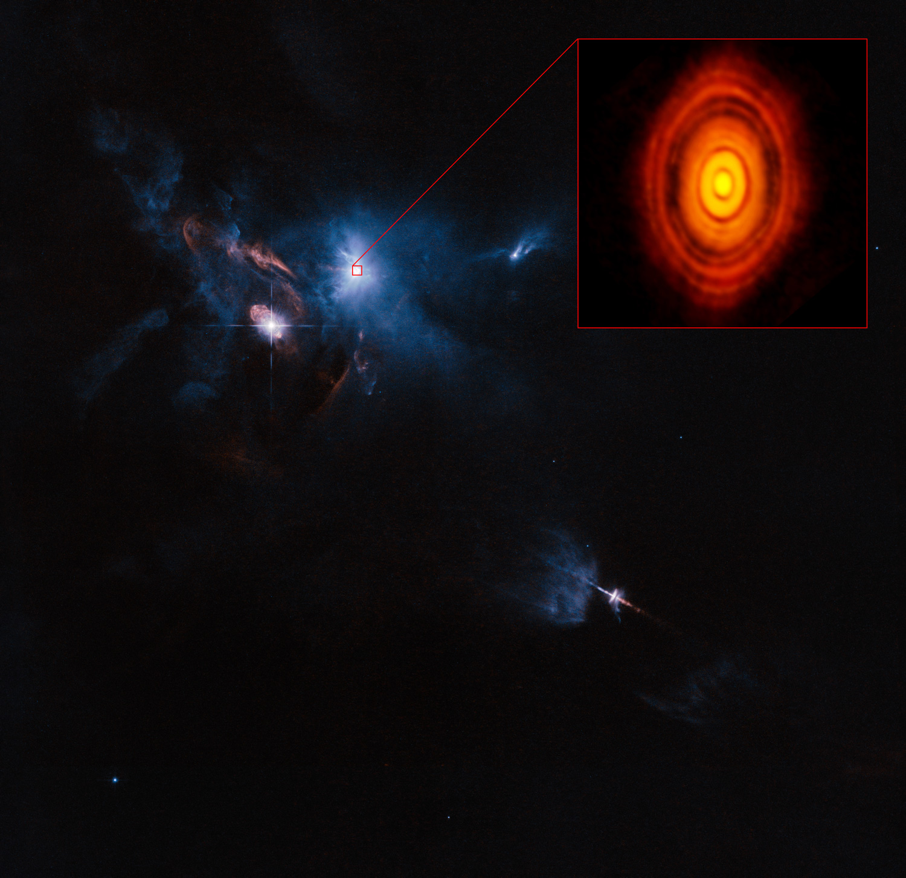
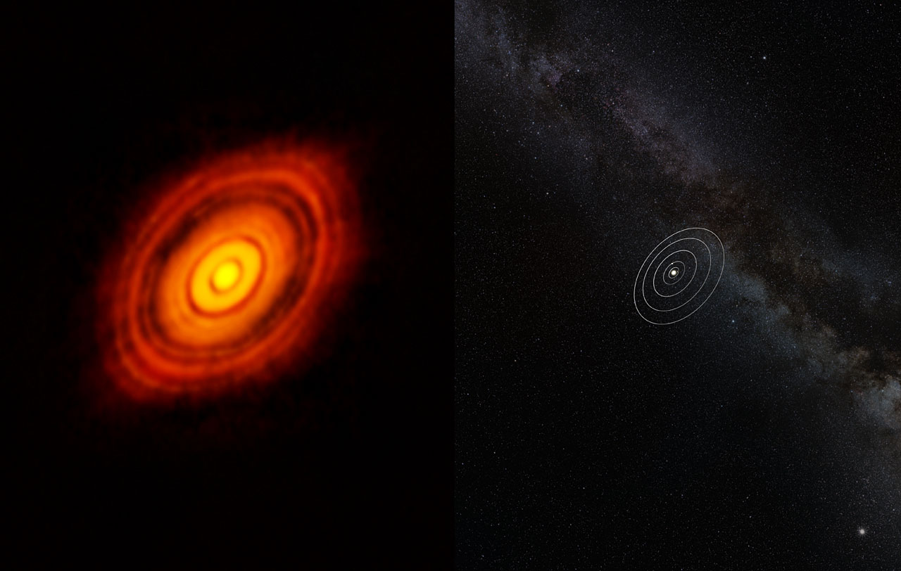
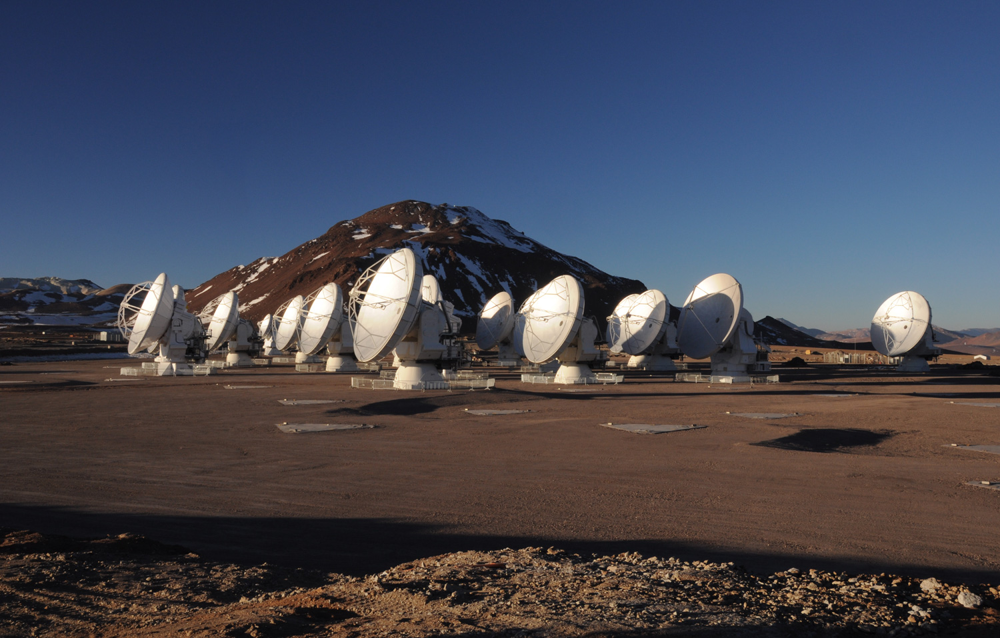

恒星星系的诞生: 首次拍到行星形成时的高清图像
==

宴请你的眼睛,我的朋友, 这 ——迄今为止最详细的图像的年轻恒星及其行星盘。 在这里你可以看到年轻的明星HLτ,只有一百万年的历史,随着周围尘埃和气体漩涡,逐渐形成行星和小行星。 不管你信不信,几十亿年前,这是我们自己的太阳系就会是什么样子。

这张照片被阿尔玛,阿塔卡马大毫米/亚毫米阵列-由66个人组成的巨型望远镜天线、高位于智利北部阿塔卡马沙漠。 根据欧洲南方天文台(ESO)运营阿尔玛, [这张图片](http://www.eso.org/public/news/eso1436/) 来自一些望远镜第一次观测的“新和最强大的模式”(阿尔玛多年来一直在建设中,但直到最近他们安装足够的天线和移动到合适的位置分辨率深空影像)。

HL Tau行星盘的注释。 ([点击这里获取未经处理的高分辨率图像](http://www.extremetech.com/wp-content/uploads/2014/11/alma-hl-tau-protoplanetary-disk.jpg)。 )

HL Tau中间的图像是一个年轻的恒星大约450光年的金牛座。 之前的观察告诉我们,有一个HL Tau周围尘云,但直到阿尔玛盯着的星尘云的性质变得明显。 看到行星盘在这样的细节是开创性的,看到这样一个磁盘恒星周围,只是一百万年的历史 令人震惊的 。 我们曾认为它花费很多的时间来恒星的尘埃和气体 合生 通过重力,行星和小行星。

哈勃HL Tau周边地区的形象

这张照片比较太阳系的大小与HL金牛座的及其周边原生行星盘。 虽然这颗恒星比太阳小得多,周围的盘HL金牛座的延伸几乎三倍的星海王星是来自太阳。

阿尔玛,高在智利的阿塔卡马沙漠,是一个相当大的望远镜
磁盘的环之间的差距,顺便说一下,是行星和小行星的警示信号目前正在组装。 由于重力原因越来越大所养成的岩石和气体,他们扫描更多的尘埃和气体——有效滚雪球,雕刻出空白磁盘继续绕着恒星。 这是相同的过程 [土星环的形成 ](http://www.extremetech.com/extreme/180579-nasas-cassini-may-have-witnessed-the-birth-and-death-of-a-new-saturnian-moon)。

回到这里在地球上,这种高分辨率观测HL Tau行星盘的希望会告诉我们很多关于我们的太阳系是如何形成的,大约四十亿年前。 以前,我们只能推测和模拟行星和恒星的形成,但现在,由于阿尔玛,我们可以看着它发生在现实世界中,几乎在真正的时间。 科学是很可怕的。

相关阅读:  [90亿像素,8400万颗恒星: 窥视世界上最详细的银河系照片](http://www.extremetech.com/extreme/139329-9-gigapixels-84-million-stars-peer-into-the-worlds-most-detailed-photo-of-the-milky-way)

原文链接: [Birth of a solar system: The first ever high-resolution image of planet formation](http://www.extremetech.com/extreme/193710-birth-of-a-solar-system-the-first-ever-high-resolution-image-of-planet-formation)

原文日期: 2014-11-06

翻译日期: 2014-11-07

翻译人员: [书三生](http://t.qq.com/renfufei)
