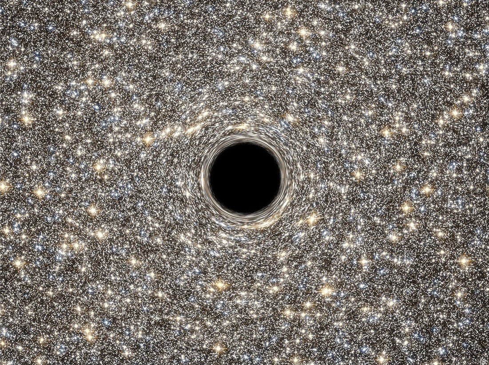
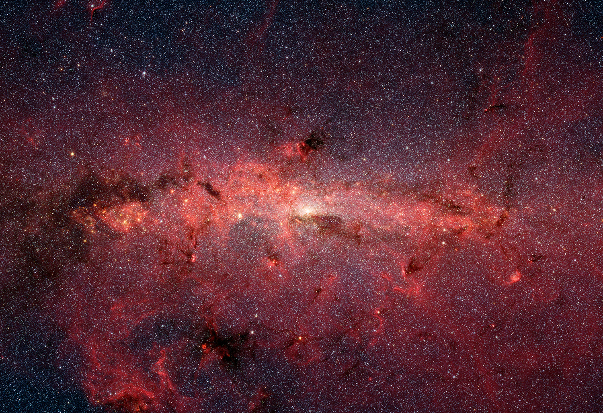

# 最小的矮星系中发现超级大黑洞 #

天文学家们最近通过分析哈勃天文望远镜拍摄后组合的图像,在已知宇宙最小的矮星系(dwarf galaxies)中心处发现了一个超大黑洞,这一发现对现有的宇宙形成理论提出了新的疑问和挑战。 矮星系中心的这个黑洞大约是银河系(Milky Way)中央的黑洞大四倍左右(目前已知的星系基本上都围绕着黑洞旋转),但令人惊讶的是,这个矮星系比银河系要小五百倍 ,直径只有300光年。 “我们还很难解释为何如此巨大的黑洞能存在于相对这么小的星系中.” 这个新研究项目的负责人阿尼尔赛斯这样说。

M60-UCD1矮星系大约由1.4亿颗恒星组成,拥挤在一个只有300光年的空间里(简直比西二旗的地铁还要挤啊!)。 相比之下,我们所在的银河系,直径超过100000光年,大概有2000亿颗恒星。 按照NASA的说法,如果晚上在这个矮星系中看太空,至少能看到100万颗恒星。 而在地球上,一般只能看到几千颗星星(星星就是恒星)。 上面是一副夜晚天空的想象效果图,如果我们在矮星系内某颗行星上有一架天文望远镜的话。 (杯具啊这只是一幅效果渲染图像 —— 矮星系距离银河系5000万光年,所以哈勃望远镜并不能观测到这些细节)。

扩展阅读: [美国宇航局(NASA)利用空余时间迅速发现十万个超级黑洞](http://www.extremetech.com/extreme/172961-nasas-swift-discovers-100000-super-massive-black-holes-in-its-spare-time)

M60-UCD1无疑是非常小的,但正因太小而变得与众不同 —— 它中心的超级黑洞使得天文学家们摸不着头脑。 对星系来说,在其中央存在超大质量的黑洞本身就不太正常 —— 我们认为大多数星系的中心都有一个黑洞,但我们一直认为在很小的星系中生出这么个超大型黑洞是不太可能的。 银河系中心的黑洞约等于四百万个太阳的质量,相当于银河系总体质量的万分之一。 M60-UCD1黑洞大约有2100万个太阳的质量,相当于该星系总质量的15%左右。 “这太令人惊讶了,要知道银河系比M60-UCD1大500倍,比它重1000倍,”赛斯说。

这就是银河系在红外线天文望远镜中的样子。 可悲的是,人类的眼睛看不出如此多的星星。

扩展阅读: [90亿像素,8400万颗恒星: 窥视世界上最详细的银河系照片](http://www.extremetech.com/extreme/139329-9-gigapixels-84-million-stars-peer-into-the-worlds-most-detailed-photo-of-the-milky-way)

现在看起来唯一合理的解释就是,这个矮星系全盛时期大约有100亿颗恒星组成 —— 但它与另一个星系,M60相撞了,导致它的大部分恒星逃逸。 M60内部超级大黑洞的质量大约是45亿个太阳的质量。 一直以来, 天文学家们认为M60和M60-UCD1可能最终会合并成一个,而且他们的黑洞也会合并。 我不能完全确定当两个超大型黑洞合并时会发生什么,也不知道这种怪物应该如何命名,但应该蛮壮观的。

扩展阅读: [宇宙的像素: 假设宇宙是一张2D全息图](http://www.extremetech.com/extreme/188727-pixels-of-the-universe-experiment-begins-to-see-if-the-universe-is-a-2d-hologram)

原文链接: [This supermassive black hole is at the center of one of the smallest galaxies in the universe](http://www.extremetech.com/extreme/190391-this-supermassive-black-hole-is-at-the-center-of-one-of-the-smallest-galaxies-in-the-universe)

原文日期: 2014年9月18日上午9:57

翻译日期: 2014-09-20

翻译人员: 书三生