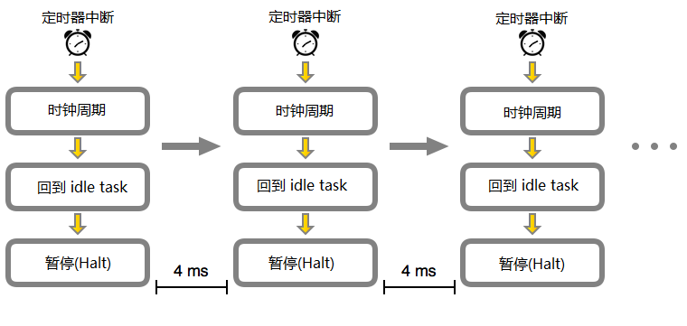

CPU在空闲时会做什么?
==

CPU在绝大部分时间是什么都不干的。 大多数技术专家都知道这个事实,但对于 CPU 是如何从空闲状态切换到工作状态,忙完后又回到空闲状态的相应机制,我们还没有详细讨论过。 对现代处理器来说这种机制变得越来越重要; 今天大部分芯片设计的一个目标是将处理器尽快地切换到低功率状态。

Gustavo Duarte 写的 [一篇详细文章](http://duartes.org/gustavo/blog/post/what-does-an-idle-cpu-do/) 指出, CPU 空闲时(idle CPU)并不是什么都不干(doing nothing) —— 而是在运行空闲任务(idle tasks)。 CPU整体设计就是完成当前操作后尽可能快速地返回到空闲状态, 但系统必须要有某种方法/方式来唤醒芯片,让它去关注其他某些东西。 其中的一种方式是使用系统计时器(system timer)。

[图片来源:Gustavo Duarte]

如 Duarte 文中所述, 阻止CPU消耗太多电量的一种方法是内置更长的时钟周期(tick periods)。 通过这种方式,CPU在唤醒之前需要度过更长的空闲时间,然后执行基本任务,接着再次睡眠。

### 什么是空闲任务(idle task)? ###

空闲任务可能听起来有点自相矛盾。 关键是你要理解CPU既然通电,那么就必须时刻不停地在运转, 即使他什么正事也不干。 在哲学上对应的词汇就是所谓的“**忙等待**”(busy waiting),本质是让 CPU 不停地去计算某个条件,看看是否为 true.

对于运行在x86芯片上的Windows来说, 这个功能表现为暂停(HLT)指令,对应 Windows 的 System Idle Process 进程。 Windows只有在某个CPU核心没有合适的线程可执行时,才会调用 idle 空闲进程去运行。 如果你查看 Windows 系统的任务管理器, 你会看到 System Idle Process(系统空闲进程) 大多数时候都显示一个较高的CPU使用百分比。 和进程列表中的其他进程不同,空闲进程的值越高,代表CPU的工作量越小。 设计 HLT 指令的目的是为了尽可能地减少电量消耗,并使 CPU 进入节能模式/状态。

HLT的历史

HLT(暂停)指令其实有很长的历史 —— 在 [第一颗8086处理器](http://www.extremetech.com/computing/105107-4004-to-sandy-bridge-40-years-of-intel-cpus) 上就已经实现了, 但早期操作系统并不支持它。 老程序员可能会记得,曾经有一段时间, 甚至连基本的 HLT 功能都总是不能按预期方式执行。 回首过去的超频年代, 那时候CPU有一个基本的工具(utility)叫做 Rain(雨), 用来实际地增加CPU的idle空闲时间(以及提升处理过程中的散热和能耗)。 随着时间的流逝,我们可以看到硬件制造厂商和软件开发者都变得越来越复杂。

这是 Windows 8 创新的一个方面 —— [好吧,本质上只是尝试创新](http://www.extremetech.com/computing/169055-why-do-windows-pcs-have-such-terrible-battery-life-compared-to-mac-and-ios) —— 但却产生了一些奇怪的结果。 在默认情况下它允许在处理过程中有更长的间隔周期,但这也导致一些程序产生问题,如Google Chrome等程序为了更快地对用户操作进行响应,会自动将时钟频率(tick rate)设置为操作系统所允许的最小值。 这个BUG在新版程序中已经修复了, 但仍可能减少某些Windows 8电脑的电池续航时间。

一颗 Intel 8086 CPU, 1978年。确实, 当时CPU是很简单的玩意儿 —— 大约只有2万个晶体管.

这确实是一个可以调节时钟周期的地方, 加上要支持没有基于晶体定时器的系统,使微软措手不及。 在Windows8中,软件通过混合操作系统时间记录的方式来调整前端总线速度,就会导致[错误的基准测试结果](http://www.extremetech.com/computing/164209-windows-8-banned-by-worlds-top-benchmarking-and-overclocking-site) 。 这种行为在[[Windows 10](http://www.extremetech.com/computing/193469-windows-10-is-great-but-it-wont-stop-the-pc-from-dying-and-taking-microsoft-with-it)]中一直保持, 尽管它只是一个小众的问题 —— 在操作系统产生错误的结果你必须调整系统前端总线的时钟.

原来的[那篇博客](http://duartes.org/gustavo/blog/post/what-does-an-idle-cpu-do/)主要讨论的是桌面操作系统,race-to-idle是现代CPU架构的关键组件。 AMD和英特尔每年都会发布新一代产品,还会经常推出更新,可能最高性能只提升那么一点点, 但通过更好的时钟门控(clock gating)却能显著提高能量使用率并更快地进行节能模式切换.

扩展阅读: [磁盘驱动器(硬盘)的工作原理](http://www.extremetech.com/computing/88078-how-a-hard-drive-works)

原文链接: [What does a CPU do when it’s doing nothing?](http://www.extremetech.com/computing/193628-what-does-a-cpu-do-when-its-doing-nothing)

原文日期: 2014-11-07

翻译日期: 2014-11-10

翻译人员: [铁锚](http://blog.csdn.net/renfufei)

