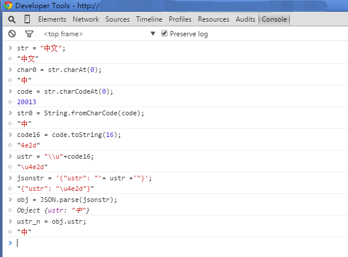

# JavaScript中字符串与Unicode编码的互相转换

这段代码演示了JavaScript中字符串与Unicode编码的转换: 

	// 为了控制台的演示方便, 变量没有添加 var 定义
	// 实际编程中请避免
	
	// 字符串
	str = "中文";
	// 获取字符
	char0 = str.charAt(0); // "中"
	
	// 数字编码值
	code = str.charCodeAt(0); // 20013
	// 编码互转
	str0 = String.fromCharCode(code); // "中"
	
	// 转为16进制数组
	code16 = code.toString(16); // "4e2d"
	
	// 变成字面量表示法
	ustr = "\\u"+code16; // "\u4e2d"
	
	// 包装为JSON
	jsonstr = '{"ustr": "'+ ustr +'"}'; //'{"ustr": "\u4e2d"}'
	
	// 使用JSON工具转换
	obj = JSON.parse(jsonstr); // Object {ustr: "中"}
	//
	ustr_n = obj.ustr; // "中"

如果是一组字符串，则需要使用到 `for` 循环来处理。

其中，我们使用了JSON工具来进行转换。

如果要兼容 IE6等浏览器,则可用如下形式进行解析:

	    	if("object" === typeof message){
	    		// 如果是对象,则不进行转换
	    	} else if(window["JSON"]){
	    		message = JSON.parse(message);
	    	} else { // IE6, IE7
    	   		message = eval("("+ message + ")");
	    	}

控制台调试结果如下所示:

日期: 2015年08月03日

人员: [铁锚 http://blog.csdn.net/renfufei](http://blog.csdn.net/renfufei)

