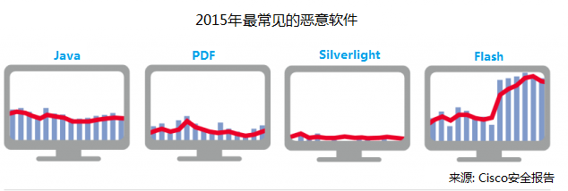

Oracle即将终结 Applet 插件
==

Oracle宣称将要终结浏览器中的Applet插件。该举动比预期要来得迟一些, 最近这些年,浏览器的Applet插件已成为黑客和恶意软件作者的最佳目标。思科在2014年的一份安全报告中指出,高达91%的攻击都是针对Java的。

在这之后情况有所改善; 思科在2015年中期报告里指出, 虽然Java仍是最主要的安全问题,但该公司在减少攻击上取得进展,总体安全得到很大改善。2015年,针对Flash的攻击急剧上升,而Java方面却呈整体下降趋势。

**2015 年,针对Java的恶意软件(Malware)开始减少, 针对 Flash  的却大幅提升**

尽管安全方面有所改进,但发布Java 9时Oracle仍然建议不要使用Applet插件,并表示在未来某个时刻将会完全删除它。Edge 和 Chrome 浏览器都已经[在路线图中放弃了对Applet的支持](http://www.extremetech.com/mobile/220136-google-plans-to-remove-oracles-java-apis-from-android-n); Firefox在2015年年底也宣布准备这样做。在历史上, Oracle一直对Applet中的漏洞反应迟钝,而它的沙盒却从未像广告宣传的那样万无一失。

>Oracle对数据库BUG的修复速度也非常缓慢,对大型互联网公司来说,这个痛点是相当痛的。

Oracle 在陈述终结浏览器插件的原因时并没有提到其破烂的沙盒模型, 也没有提及缺乏自动更新机制。相反,[它写道](http://www.oracle.com/technetwork/java/javase/migratingfromapplets-2872444.pdf):

> 随着Java成为主流的开发平台, applet 的宿主(host) —— web浏览器也是如此。快速崛起的移动设备浏览器, 一般不支持插件,浏览器厂商越来越希望在产品中限制和消除基于标准的插件支持, 因为他们试图统一桌面和移动版本的浏览器特性。必须要浏览器厂商提供相应的跨浏览器插件标准API(如 NPAPI) , JRE才能运行 Applet。

换句话说, Java(的Applet)曾经是神奇的黑科技, 但最后折磨得浏览器厂商要将其杀死。

如果你不是特别需要,我们建议你卸载Java。需要Java的人肯定会明确知道。IE11仍然支持Java,但 Chrome 已逐步移除, Mozilla正准备这样做。Oracle 的迁移文档建议依赖Applet插件的公司应该着手准备 “免费的替代品”。

计算机安全,天然就是一个变动的目标。但时不时的,白帽子团队(Team White Hat)也会获得真正的胜利。随着Adobe Flash 的迅速衰落以及Applet插件将要面临的死亡日期,互联网应该会相对安全那么一点点时间。

欢迎加入: [CNC开源组件开发交流群 316630025](http://jq.qq.com/?_wv=1027&k=Z4v6kn)

原文链接: [http://www.extremetech.com/internet/222121-oracle-is-finally-killing-the-java-browser-plug-in](http://www.extremetech.com/internet/222121-oracle-is-finally-killing-the-java-browser-plug-in)

原文日期: 2016年01月28日

翻译日期: 2016年01月29日

翻译人员: [铁锚 http://blog.csdn.net/renfufei](http://blog.csdn.net/renfufei)
